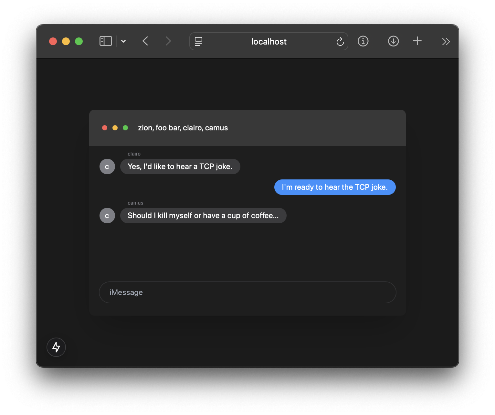

# React iMessage Clone

## Running locally

First, setup this [server](https://github.com/zion-off/fastapi-sqlite-server). Clone the repository and run these commands:

```
source .venv/bin/activate
pip install requirements.txt
uvicorn main:app --reload
```

Add an env file to the root of your clone of this repository with the following contents:

```
NEXT_PUBLIC_BACKEND=localhost:8000
```

Then start the client:

```
npm install
npm run dev
```

Navigate to `localhost:3000` and authenticate to send and receive messages.

## Tools

Built with Next.js 15 and Tailwind CSS.

## Demo


